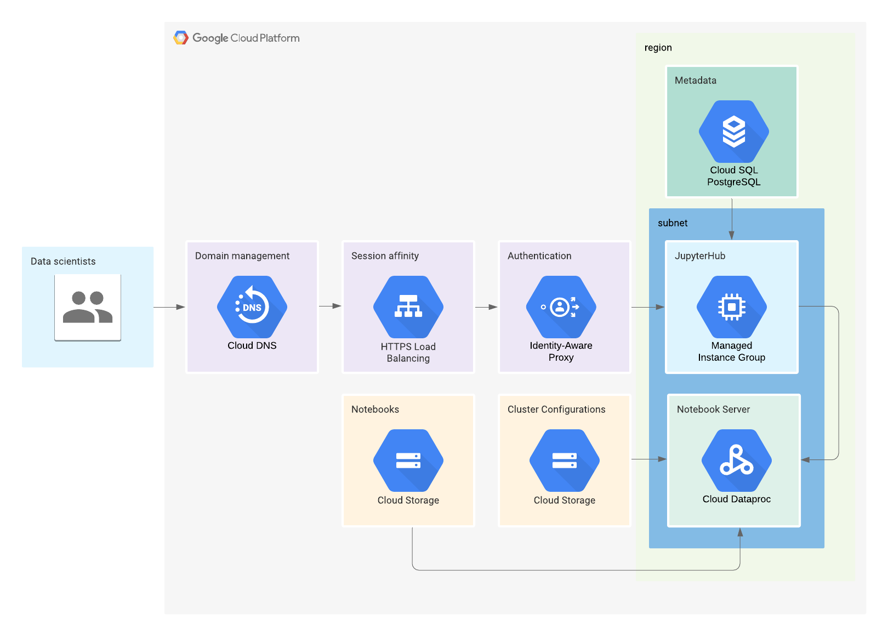

This deploys JupyterHub on a GCE managed instance group. All related resources will reside in the same region as the JupyterHub instance to provide best user experience and limit costs.

## Files

File | Description 
-----------|-------------
[prework](https://github.com/GoogleCloudPlatform/ai-notebooks-extended/tree/master/dataproc-hub-example/prework)   | Scripts to run before you can leverage the Terraform setup.
[build](https://github.com/GoogleCloudPlatform/ai-notebooks-extended/tree/master/dataproc-hub-example/build)          | Contains Terraform, Cloud Build, and others scripts to automate the creation of the platform described in this file.
[build/dataproc-custom-image-builder](https://github.com/GoogleCloudPlatform/ai-notebooks-extended/tree/master/dataproc-hub-example/build/dataproc-custom-image-builder) | Files to create a Cloud Dataproc custom image providing a shell file.
[build/dataprochub-builder](https://github.com/GoogleCloudPlatform/ai-notebooks-extended/tree/master/dataproc-hub-example/build/dataprochub-builder) | Files to create a Docker container that installs JupyterHub.
[build/infrastructure-builder](https://github.com/GoogleCloudPlatform/ai-notebooks-extended/tree/master/dataproc-hub-example/build/infrastructure-builder) | Files to create the infrastructure of this guide.

## Prerequisites

1. Install Terraform as explained in the [Terraform documentation](https://learn.hashicorp.com/terraform/getting-started/install.html).

1. Be sure, that you have at least either primitive role *"roles/editor"* or the following custom roles: 
    1. *roles/cloudbuild.builds.editor*
    1. *roles/cloudsql.editor*
    1. *roles/dataproc.editor*
    1. *roles/deploymentmanager.editor" 
    1. *roles/iam.serviceAccountCreator*
    1. *roles/compute.admin*
    1. *roles/cloudkms.admin*
    1. *roles/secretmanager.admin*
    1. *oles/resourcemanager.folderAdmin*
    1. [Optional] *roles/dns.admin*


### Automation

The automated deployment of this architecture leverages Cloud Build and Terraform. Cloud Build uses a builder image provided by Terraform.

### DNS

You have a domain such as example.com that you can manage through [Cloud DNS](https://console.cloud.google.com/net-services/dns/zones). If you manage your domain somewhere else, adapt that part in the Terraform script. 

For example, if you moved your Google Domain to Cloud DNS, you would need to have the following set up:

1. In Cloud DNS:

    ```
    example.com.	NS	60	
    ns-cloud-a1.googledomains.com.
    ns-cloud-a2.googledomains.com.
    ns-cloud-a3.googledomains.com.
    ns-cloud-a4.googledomains.com.

    example.com.	SOA	60	
    ns-cloud-a1.googledomains.com. cloud-dns-hostmaster.google.com. 10 21600 3600 259200 300
    ```

1. In Google Domain, use custom name servers:

    ```
    ns-cloud-a1.googledomains.com
    ns-cloud-a2.googledomains.com
    ns-cloud-a3.googledomains.com
    ns-cloud-a4.googledomains.com
    ```
   
**/!\ Important**: If you use Cloud DNS, you need to put the name of Cloud DNS zone onto terraform config file, variable "dns_zone", 
otherwise, leave this variable empty. 


### OAuth setup
We recommend to use Cloud IAP and the jupyterhub-gcpproxiesauthenticator so users are authenticated automatically to the DataprocHub interface. Set up is done by Terraform.

If you decided to use another mean of authentication such as oauthenticator, you would need to create an Oauth Client ID in the [APIs & Services > Credentials](https://console.cloud.google.com/apis/credentials).

## Cloud Build

This tutorials shows you how to run Cloud Build manually but the repository also provides the code to support triggers and only the folders where there was a code change will be built. 

You can see the logic in the [cloudbuild.yaml](cloudbuild.yaml) file where you can uncomment the `substitions` at the bottom of the file.

To make sure that you build the right folder when you run the build manually, set the _BUILD_FOLDERS variables in [cloudbuild_substitutions.sh](../../../../cloudbuild_substitutions.sh):
    
    1. All folders must finished with trailing '/'
    1. All folders must be separated by the character that you specify in _BUILDER_FOLDERS_SEP. By default, it is '#'

## Setup your environment
In this tutorial, you run commands in Cloud Shell. Cloud Shell is a shell environment with the Cloud SDK already installed, including the gcloud command-line tool, and with values already set for your current project. Cloud Shell can take several minutes to initialize.

1. In the GCP Console for the build project, open Cloud Shell.

    [OPEN CLOUD SHELL](https://console.cloud.google.com/?cloudshell=true)

1. Set up the following variables in you Cloud Shell interface:

    ```sh
    export PROJECT_ID=[YOUR-PROJECT-ID]
    ```

1. Set your GCP project:

    ```sh
    gcloud config set project ${PROJECT_ID}
    ```

1. Clone the repository containing the code for the sample app used in this tutorial:

    ```sh
    git clone https://github.com/GoogleCloudPlatform/ai-notebooks-extended.git
    ```

1. If you want to set the custom Service Account to execute GCP commands, you have to set up the following:
    
    ```
   export SA_KEYFILE=[PATH-TO-SA-KETFILE]
   export GOOGLE_CLOUD_KEYFILE_JSON=${SA_KEYFILE}
   gcloud auth activate-service-account --key-file=${SA_KEYFILE}
   ```
   This step is optional and can be passed only if you need to use a custom Service Account.

1. Go to the project directory and start the prework

    ```sh
    cd ./ai-notebooks-extended/dataproc-hub-example/prework
    ```

## Prework
This tutorial requires some resources to run. You only need to create them once if you reuse the same project:

1. Enable GCP APIs

    ```sh
    chmod +x enable_apis.sh
    ./enable_apis.sh ${PROJECT_ID}
    ```     
   This script will enable the following APIs:
    1. bigquery.googleapis.com
    1. bigquerystorage.googleapis.com
    1. cloudbuild.googleapis.com
    1. cloudkms.googleapis.com
    1. cloudresourcemanager.googleapis.com
    1. compute.googleapis.com
    1. containerregistry.googleapis.com
    1. dataproc.googleapis.com
    1. dns.googleapis.com
    1. iam.googleapis.com
    1. secretmanager.googleapis.com
    1. servicenetworking.googleapis.com
    1. storage-api.googleapis.com
    1. storage-component.googleapis.com
    1. sqladmin.googleapis.com
    1. sql-component.googleapis.com
    1. storage-component.googleapis.com

1. Set up Cloud Build’s identity and access management

    ```sh
    chmod +x set_permissions.sh
    ./set_permissions.sh ${PROJECT_ID}
    ```

## DataprocHub image
DataprocHub leverages JupyterHub and in this setup, it runs on Compute Engine instances using a container-based image. Although, as an administrator, you can set up predefined environments without changing the JupyterHub container image, you might want to customize it further by changing the files detailed by the Configuration files of the guide.

After making your changes to the JupyterHub container files, you can run the steps manually:

1. Update the _BUILD_FOLDERS variable in [cloudbuild_substitutions.sh](../../../../cloudbuild_substitutions.sh) to the *_BUILD_FOLDERS="dataproc-hub-example/build/dataprochub-builder/"*

1. In case, if you want to add some custom settings, you need to edit the [jupyterhub_config.py](dataproc-hub-example/build/dataprochub-builder/jupyterhub_config.py). 

1. Build and deploy the JupyterHub docker image with a Cloud Dataproc spawner

    ```sh
    chmod +x ./cloudbuild_manual.sh
    ./cloudbuild_manual.sh ${PROJECT_ID}
    ```

Those actions will create a container image with the JupiterHub server. The image will be stored on the Container Registry of your project. 
Also, a uri of the JupiterHub image will be needed in the future step. The uri should looks like "gcr.io/[PROJECT_ID]/jupyterhub"

**/!\ Important**: You can decide to automatically running a rolling update on the managed instance group after a new docker image is created. Update the `_DHB_UPDATE_MIG` parameter in [cloudbuild_substitutions.sh](../../../../cloudbuild_substitutions.sh) to fit your needs.

## Cloud Dataproc custom image
When you create predefined clusters configurations, you can use two approaches to spawn a cluster:
- Either you use an initialization action to install all the libraries when the cluster starts 
- Or you use a Cloud Dataproc Custom Image with all the libraries already installed.

*/!\ Note*: We recommend to create a new Cloud Dataproc custom image to speed up the cluster's starting time. This section describes the process of creating such image. You can also skip this section and use default images provided by GCP. You can use initialization actions with both options.

Although this code provides an example script to create a Dataproc custom image that includes Tensorflow, we recommend to create your own.

To build a custom image from your initialization script, follow these steps:

#### Create builder for Dataproc custom images

This only needs to be done once per project. This builder Docker image will be able to create your future Dataproc custom images.

We recommend to use this Cloud Build's [Docker image building steps](https://github.com/GoogleCloudPlatform/cloud-builders-community/tree/master/dataproc-custom-image): 

1. From the Cloud Shell, clone the repository and access the folder to contains the Dataproc custom image builder code:

    ```sh
    git clone https://github.com/GoogleCloudPlatform/cloud-builders-community.git \
    && cd cloud-builders-community/dataproc-custom-image
    ```
1. Set your project ID

    ```sh
    PROJECT_ID=[YOUR_PROJECT_ID]
    ```

1. Create the builder image

    ```sh
    gcloud builds submit . --config=cloudbuild.yaml
    ```

This will provide you with a Docker image that can create Cloud Dataproc custom images. The new Docker image will be stored on the gcr.io registry. If you did not change any parameter, the image is available at ```gcr.io/[YOUR_PROJECT_ID]/dataproc-custom-image```


#### Create the Dataproc custom image

To build a custom image:
1. Write a shell script similar to [customization-script.sh](https://github.com/GoogleCloudPlatform/ai-notebooks-extended/tree/master/dataproc-hub-example/build/dataproc-custom-image-builder/customization-script.sh) which is provided as an example.
1. Save it to the same folder
1. Update *_DCI_CUSTOMIZATION_SCRIPT_PATH* in [cloudbuild_substitutions.sh](../../../../cloudbuild_substitutions.sh)
1. Run the following command to create the custom image. It might take a while.
1. Update the _BUILD_FOLDERS variable in [cloudbuild_substitutions.sh](../../../../cloudbuild_substitutions.sh) to the *_BUILD_FOLDERS="dataproc-hub-example/build/dataproc-custom-image-builder/"*

    ```sh
    chmod +x ./cloudbuild_manual.sh
    ./cloudbuild_manual.sh ${PROJECT_ID}
    ```

## Deploying and running the Jupyterhub server

First, you need to set up your own variables for Terraform:

1. Copy [terraform.template.tfvars]() into a new file named terraform.tfvars in the same folder

    ```sh
    cd dataproc-hub-example/build/infrastructure-builder/mig/
    mv terraform-builder/terraform.template.tfvars terraform-builder/terraform.tfvars
    ```

1. In terraform.tfvars, update the values as needed.

Next, leverage the templated ClusterConfig configuration files in the [configs](https://github.com/GoogleCloudPlatform/ai-notebooks-extended/tree/master/dataproc-hub-example/build/infrastructure-builder/mig/files/gcs_working_folder/configs) folder to create your own cluster configuations:

1. Copy the files that you are interested in or create your own
1. If you use the , update the *imageUri* parameter, update the <YOUR-PROJECT> with your own.

Next, you can prepare your custom auto scaling policy in the [config](https://github.com/GoogleCloudPlatform/ai-notebooks-extended/blob/master/dataproc-hub-example/build/infrastructure-builder/mig/main.tf) or use default one

Also, you can review and change the default notebooks that gets downloaded to the user folder [there](https://github.com/GoogleCloudPlatform/ai-notebooks-extended/tree/master/dataproc-hub-example/build/infrastructure-builder/mig/files/gcs_working_folder/examples)

Before starting this step, you should have:

1. Cloud Build service account setup with the relevant IAM (done in Prework)
1. The provided Docker image for your JupyterHub frontend available in your container registry. (done in JupyterHub image)
1. The Cloud Dataproc custom image (or similar) available in a Cloud Storage bucket. (done in Cloud Dataproc custom image)
1. Update the _BUILD_FOLDERS variable in [cloudbuild_substitutions.sh](../../../../cloudbuild_substitutions.sh) to the *_BUILD_FOLDERS="dataproc-hub-example/build/infrastructure-builder/mig"*

In this section, you deploy the architecture detailed in the Architecture section of the guide using Cloud Build and Terraform.

```sh
chmod +x ./cloudbuild_manual.sh
./cloudbuild_manual.sh ${PROJECT_ID}
```

After this commmand completes, you should have set up:
- Service accounts
- Load balancer
- Managed instance group for JupyterHub
- Cloud SQL PostgreSQL for Jupyterhub metadata
- Cloud Storage buckets and uploaded the relevant objects to their respective Cloud Storage folder or bucket.
- Secrets
    
If you need to run JupyterHub on a single GCE instance, we recommend to use the official [Dataproc Hub product](https://cloud.google.com/dataproc/docs/tutorials/dataproc-hub-admins) which runs on an AI Platform Notebook instance and is supported by Google. It also provide a secure URL without you having to use your domain.

### Troubleshooting

1. Terraform fails when deploying `google_iap_brand`:

    > Someone might already have set the OAuth consent page manually in the Cloud Console. You need to import that existing one using [Terraform import](https://www.terraform.io/docs/providers/google/r/iap_brand.html#import).

    > You can use the gcloud command to retrieve the existing brand's information.

1. Terraform fails when trying to deploy `google_iap_client`:

    > Make sure that your OAuth consent page in the Cloud Console has `User type` set to Internal. You can change that parameter later.

## Disclaimer

[This is not an official Google product](https://opensource.google.com/docs/releasing/publishing/#disclaimer)

The examples of this repository are not supported by Google. If you need to deploy them in production, reach out to a Google [Cloud certified partners](partners) or your local sales team.