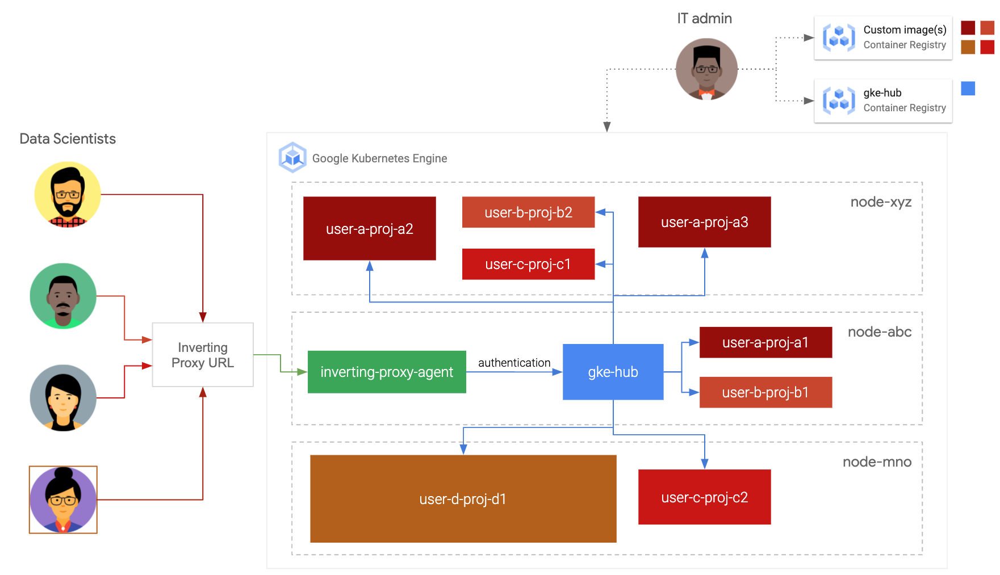

# GKE Hub



This folder shows how to deploy notebooks on Google Kubernetes Engine by combining:

1. AI Notebooks architecture: Leverages a modified version of the [Inverting Proxy server][proxy_server] managed by Google and a local [Inverting Proxy agent][proxy_agent] to provide a secure endpoint access to a Hub.
1. Hub architecture: Using [JupyterHub][jupyterhub], adminstrators can provide a centrally-managed list of notebook environment that end users can spawn on a Kubernetes clusters.

Administrator can modify official [AI Notebook servers images][ain] to run them on a Google Kubernetes Engine cluster.

## Folders and file

1. Folder [deploy](./deploy): Contains GKE manifests and bash script to deploy manually the infrastructure and workloads.
1. Folder [docker](./docker): Contains docker setups to create the Hub, the Agent and Jupyter environments.

## Install and run

Currently, the scripts are run manually. Deployments on Google Kubernetes Engine use [Kustomize][kustomize]

### Manually

1. From your Cloud Shell, clone this repository

    ```sh
    git clone https://github.com/GoogleCloudPlatform/ai-notebooks-extended.git
    cd gke-hub-example/deploy/manually
    ```

1. Set your working project

    ```sh
    gcloud config set project [YOUR-PROJECT-ID]
    ```

1. Install the tools to run this demo

    ```sh
    chmod +x 00-install-tools.sh
    bash 00-install-tools.sh
    ```

1. Create the infrastructure

    ```sh
    chmod +x 20-create-infrastructure.sh
    bash 20-create-infrastructure.sh
    ```

1. Create Jupyter environments in the ./docker/jupyter folder. There is already a jupyter-mine-basic as an example. You can use official [AI Notebook servers images][ain] as a base for your Dockerfile.

1. Modify the IMAGES_JUPYTER variable in [10-set-variables](set_variables) to add the relevant image names as comma separated list. This method is recommended if you are trying things locally. To add limits and other profile information, you can modify directly the [jupyter_config.py](jupyter_config) and add profiles directly there. See the profile_list parameter in the [Kubespawner documentation](https://jupyterhub-kubespawner.readthedocs.io/en/latest/spawner.html).

1. Create docker images and deploy workloads

    a. Locally

    ```sh
    chmod +x 30-deploy-gke-workloads.sh
    bash 30-deploy-gke-workloads.sh local true
    ```

    b. On GKE

    ```sh
    chmod +x 30-deploy-gke-workloads.sh
    bash 30-deploy-gke-workloads.sh gke true
    ```

1. Check that you see your pods being deployed

    ```sh
    kubectl get pods
    ```

1. Access the JupyterHub UI

    a. Locally, you should see a windown being opened automatically using a localhost URL.

    b. On GKE, you need to get the URL proxy URL that provides a secure access to JupyterHub. That proxy URL automatically recognize the user authenticated to Google Cloud

    ```sh
    bash 40-get-hub-url.sh
    ```

## Clean up

1. Delete workloads

    ```sh
    bash 93-delete-gke-workloads.sh [local|gke]
    ```

1. Delete cluster

    ```sh
    source 10-set-variables.sh
    gcloud container clusters delete ${CLUSTER_NAME} \
      --project ${PROJECT_ID} \
      --zone ${ZONE}
    ```


## Disclaimer

[This is not an official Google product](https://opensource.google.com/docs/releasing/publishing/#disclaimer)

The examples of this repository are not supported by Google. If you need to deploy them in production, reach out to a Google [Cloud certified partners](partners) or your local sales team.

[proxy_server]: https://github.com/google/inverting-proxy/tree/master/server
[proxy_agent]: https://github.com/google/inverting-proxy/tree/master/agent
[jupyterhub]: https://jupyter.org/hub
[ain]: https://cloud.google.com/ai-platform/deep-learning-containers/docs/choosing-container#choose_a_container_image_type
[set_variables]: .deploy/manually/10-set-variables.sh
[jupyter_config]: ./docker/jupyter_config.py
[kustomize]: https://kustomize.io/
